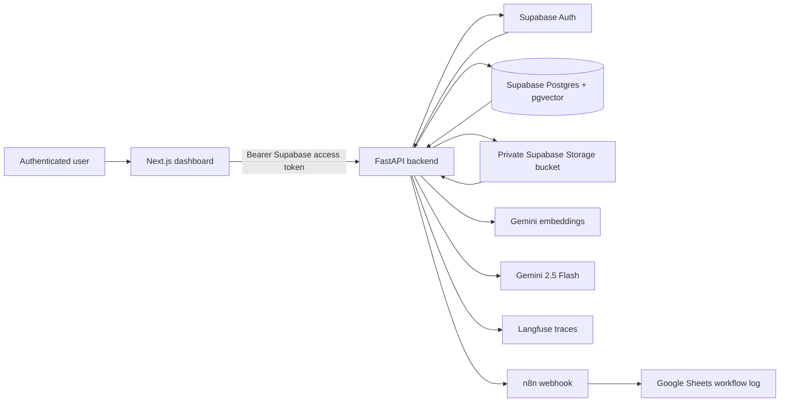
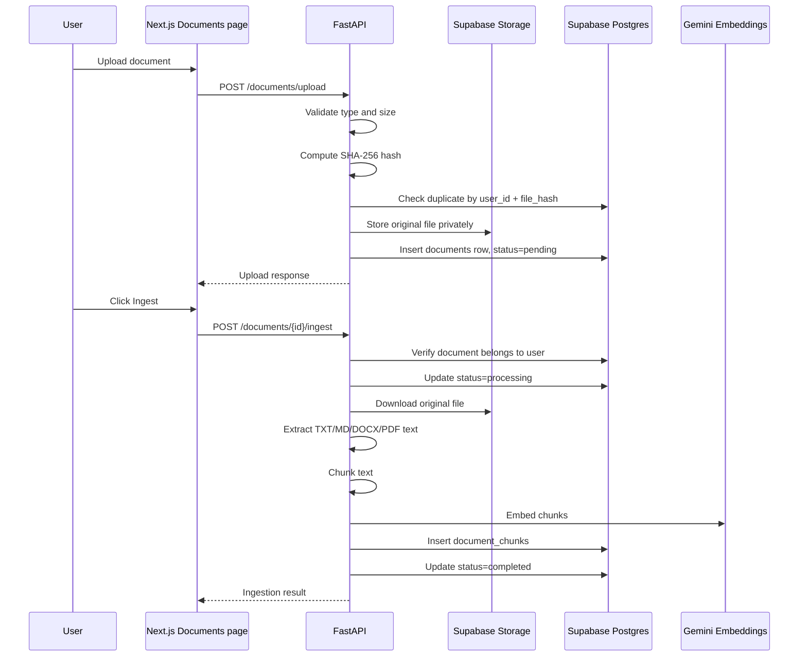
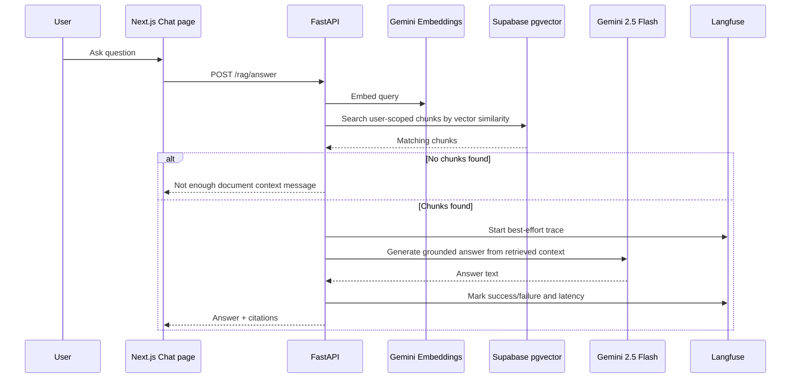
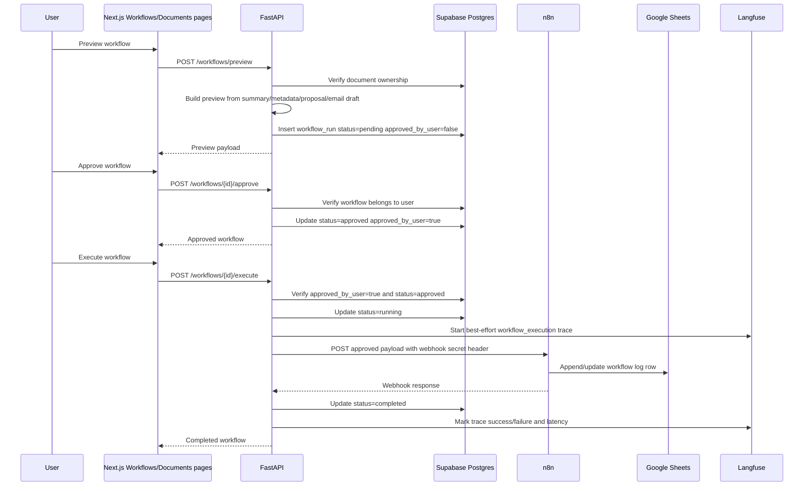

# BizFlow AI Architecture

BizFlow AI is a full-stack document intelligence and workflow automation platform. The current implementation combines a Next.js dashboard, FastAPI backend, Supabase Auth/Postgres/Storage, Gemini embeddings and text generation, n8n workflow execution, Google Sheets logging through n8n, and Langfuse observability.

## High-Level Architecture



Core boundaries:

- The frontend authenticates users and calls the backend with Supabase access tokens.
- The backend validates identity, enforces ownership, coordinates document/RAG/workflow logic, and keeps secrets server-side.
- Supabase stores users, documents, chunks, workflow runs, and private uploaded files.
- Gemini powers embeddings and text generation.
- n8n executes only approved workflow payloads.
- Langfuse receives best-effort traces for AI and workflow operations.

## Frontend Layer

Location: `apps/web`

Responsibilities:

- Supabase browser auth and session handling.
- Dashboard routes for documents, chat, workflows, and settings.
- Authenticated API requests through `src/lib/api-client.ts`.
- Document upload, ingestion actions, metadata/summary/proposal/email generation actions.
- Chat page for RAG search and grounded answer generation.
- Workflow page for preview review, approval, execution, and status display.

Frontend rules:

- It never receives provider API keys, Supabase service role keys, n8n secrets, or Langfuse secret keys.
- It uses public environment variables only, such as `NEXT_PUBLIC_API_BASE_URL`, `NEXT_PUBLIC_SUPABASE_URL`, and `NEXT_PUBLIC_SUPABASE_ANON_KEY`.
- It does not execute workflows directly; it requests backend-controlled workflow execution.

## Backend API Layer

Location: `apps/api`

Primary routers:

- `GET /health`
- `GET /me`
- `GET /documents`
- `POST /documents/upload`
- `POST /documents/{document_id}/ingest`
- `POST /documents/{document_id}/metadata`
- `POST /documents/{document_id}/summary`
- `POST /documents/{document_id}/proposal`
- `POST /documents/{document_id}/email-draft`
- `POST /rag/search`
- `POST /rag/answer`
- `GET /workflows`
- `POST /workflows/preview`
- `POST /workflows/{workflow_id}/approve`
- `POST /workflows/{workflow_id}/execute`

Key service boundaries:

- `DocumentService`: upload, duplicate detection, document listing.
- `IngestionService`: extraction, chunking, embeddings, chunk persistence, status transitions.
- `EmbeddingService`: Gemini embedding interface.
- `GenerationService`: Gemini 2.5 Flash text generation interface.
- `RagSearchService`: vector search over user-scoped chunks.
- `RagAnswerService`: grounded answer generation with citations.
- `DocumentMetadataService`: structured metadata extraction.
- `DocumentSummaryService`: summary and recommended actions generation.
- `DocumentProposalService`: proposal draft generation.
- `DocumentEmailDraftService`: email draft generation.
- `WorkflowService`: preview, approval, execution, status updates.
- `N8nService`: outbound n8n webhook calls.
- `ObservabilityService`: best-effort Langfuse tracing.

## Supabase Database, Storage, And Auth Layer

Supabase provides:

- Auth identity and access tokens.
- Postgres relational storage.
- pgvector for document chunk embeddings.
- Private Storage bucket for uploaded originals.
- Row Level Security for user-owned data.

Important tables:

- `documents`: uploaded document metadata, status, summary, generated metadata.
- `document_chunks`: extracted chunks, chunk metadata, Gemini vectors.
- `workflow_runs`: previewed, approved, running, completed, or failed workflow executions.

Security shape:

- User-owned rows include `user_id`.
- RLS policies scope records with `auth.uid() = user_id`.
- Grants allow the authenticated role to access relevant tables.
- RLS determines which rows are visible or writable.
- Original files live in a private `documents` storage bucket.

## RAG Ingestion Pipeline



Supported extraction today:

- TXT and MD direct text extraction.
- DOCX paragraph text extraction.
- PDF page-by-page text extraction with page metadata where available.

The pipeline stores Gemini `gemini-embedding-001` vectors with 3072 dimensions.

## RAG Answer Pipeline



RAG answer rules:

- Retrieval is scoped to the authenticated user.
- The model receives retrieved chunks, filenames, and chunk indexes.
- The prompt instructs the model to use only retrieved document context.
- Responses include citations with document ID, filename, chunk index, and preview.
- Langfuse failures do not break answer generation.

## Business Output Generation Pipeline

Business outputs are generated only for completed/ready documents with ingested chunks.

Implemented outputs:

- Metadata extraction
- Summary and recommended actions
- Proposal draft
- Email draft

Pipeline:

```text
Completed document
  -> retrieve document chunks
  -> build constrained prompt from chunks and existing metadata
  -> Gemini 2.5 Flash generates structured JSON/text
  -> backend parses and validates output
  -> backend merges result into documents.metadata and/or documents.summary
  -> frontend displays reviewable output
```

Safety controls:

- Uploaded document text is treated as untrusted.
- Prompts instruct Gemini not to follow instructions inside documents.
- JSON outputs are parsed and validated before persistence.
- Metadata merges preserve existing fields instead of replacing the whole object unnecessarily.
- No email is sent as part of email draft generation.

## Workflow Approval And n8n Execution Pipeline



Workflow status transitions:

```text
pending -> approved -> running -> completed
pending -> approved -> running -> failed
```

Rules:

- Only the owner can preview, approve, list, or execute workflow runs.
- Only approved workflows can execute.
- `approved_by_user` must be true before execution.
- n8n receives `workflow_id`, `workflow_type`, `document_id`, `input_payload`, `output_payload`, and approval state.
- The webhook secret is sent from the backend only.
- Google Sheets logging is handled by n8n, not the frontend.

## Observability With Langfuse

`ObservabilityService` instruments key operations:

- `rag_answer`
- `metadata_extraction`
- `document_summary`
- `proposal_generation`
- `email_draft_generation`
- `workflow_execution`

Captured safe metadata:

- operation name
- user ID
- document ID
- workflow ID where applicable
- model name
- success/failure
- latency
- error type/message on failure

Not captured:

- API keys
- webhook secrets
- Supabase service role keys
- access tokens
- full private documents
- full prompts
- embeddings

Langfuse is best-effort. If Langfuse is disabled, unconfigured, or throws during client initialization, span start, update, or end, the core operation continues.

## Security Model

Authentication and ownership:

- Supabase Auth is the identity provider.
- FastAPI validates Bearer tokens through the auth dependency.
- Backend services pass `user_id` into Supabase REST filters.
- RLS policies enforce row isolation by `auth.uid() = user_id`.

Document security:

- Original uploads are stored in a private bucket.
- Uploads are validated for extension and size.
- SHA-256 hashes are used for duplicate detection.
- Document extraction does not grant documents authority over system behavior.

AI safety:

- Prompts treat uploaded documents as untrusted.
- Generated structured outputs are parsed and validated.
- RAG answers are grounded in retrieved chunks.
- Missing context returns a not-enough-information message.

Workflow safety:

- External execution requires a stored approval event.
- The model cannot approve workflows.
- The frontend cannot call n8n directly.
- n8n secrets stay in backend environment variables.

Observability safety:

- Traces use safe metadata only.
- Observability failures are logged but do not fail user requests.

## Failure Handling And Status Transitions

Document upload:

- Invalid file type returns a client error.
- Oversized files return a client error.
- Duplicate files return an upload response with `duplicate=true`.
- Supabase failures return backend errors without exposing secrets.

Document ingestion:

```text
pending -> processing -> completed
pending -> processing -> failed
```

Failure metadata is stored where possible in `documents.metadata.ingestion_error`.

Document generation:

- Missing chunks return an ingest-first error.
- Invalid model JSON is rejected safely.
- Gemini provider errors are logged with model name and exception type/message, but not prompts or keys.
- Existing HTTP error behavior is preserved.

RAG answer:

- Empty/invalid queries are rejected by request validation.
- No matching chunks returns a grounded not-enough-context message.
- Gemini failures return the existing backend error behavior.
- Langfuse failures cannot cause `/rag/answer` to fail.

Workflow execution:

```text
pending -> approved -> running -> completed
pending -> approved -> running -> failed
```

- Pending workflows cannot execute.
- Failed n8n calls update `workflow_runs.status=failed`.
- Error messages are saved to `workflow_runs.error_message`.
- Successful n8n calls update `workflow_runs.status=completed`.
